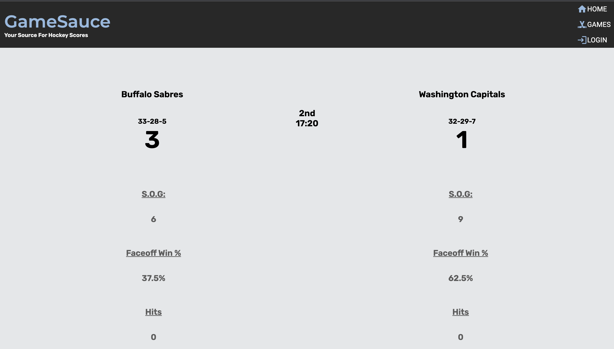

# gameSauceNHLApplication

## Description
This application is a full MERN stack application, that integrates the NHL's public API. Featuring a clean, and easy to navigate UI, this application pulls information from the NHL's public API, where code logic filters out all of the necessary game data and displays it on the user interface. The "Homepage" features either the first game to be played if no game has started, the most current game that has started if any of the games are in progress, or if all games have been finished, it displays the last game played that night. There is a "Games" page that features all of the days games, with scores. These game boxes can be clicked to bring the user back to a page similar to the homepage, except displaying the game they clicked on statistics. Clicking home will bring the user back the homepage where the most current game will be displayed. The application features Material UI for layout, styling, and forms on the login and sign up pages.

## Usage
This application can be used by following the link provided below. At this time the project is a personal project and not open for public contributions.
Link: https://gamesauce-project.herokuapp.com/

## Contributors

